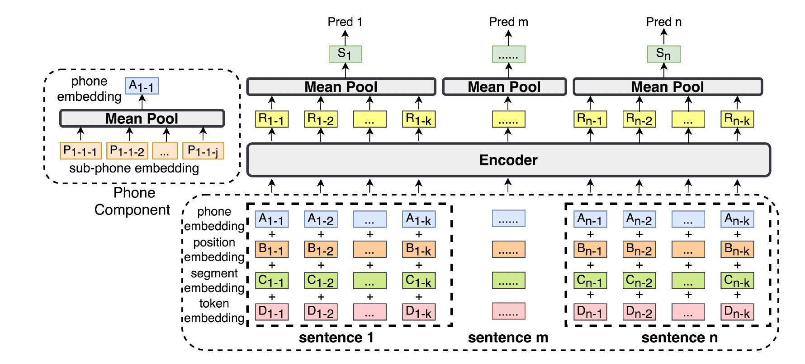
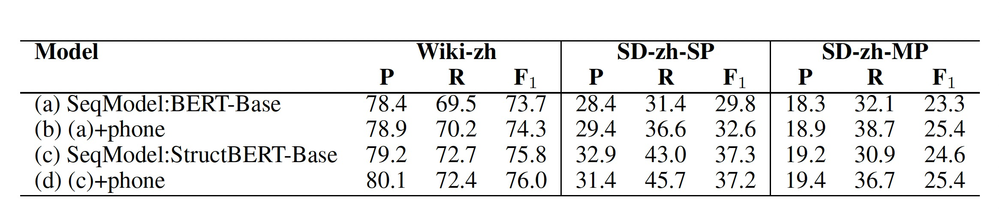

---
tasks:
- document-segmentation
model_type:
- bert
domain:
- nlp
framework:
- pytorch
backbone:
- transformers
license: Apache License 2.0
language:
- cn
tags:
- document segmentation
- 文本分割
- 段落分割
widgets:
  - task: document-segmentation
    inputs:
      - type: text
        name: input
        title: 文本
    examples:
      - name: 1
        title: 示例1
        inputs:
          - name: input
            data: 近年来，随着端到端语音识别的流行，基于Transformer结构的语音识别系统逐渐成为了主流。然而，由于Transformer是一种自回归模型，需要逐个生成目标文字，计算复杂度随着目标文字数量线性增加，限制了其在工业生产中的应用。针对Transoformer模型自回归生成文字的低计算效率缺陷，学术界提出了非自回归模型来并行的输出目标文字。根据生成目标文字时，迭代轮数，非自回归模型分为：多轮迭代式与单轮迭代非自回归模型。其中实用的是基于单轮迭代的>非自回归模型。对于单轮非自回归模型，现有工作往往聚焦于如何更加准确的预测目标文字个数，如CTC-enhanced采用CTC预测输出文字个数，尽管如此，考虑到现实应用中，语速、口音、静音以及噪声等因素的影响，如何准确的预测目标文字个数以及抽取目标文字对应的声学隐变量仍然是一个比较大的挑战；另外一方面，我们通过对比自回归模型与单轮非自回归模型在工业大数据上的错误类型（如下图所示，AR与vanilla NAR），发现，相比于自回归模型，非自回归模型，在预测目标文字个数方面差距较小，但是替换错误显著的增加，我们认为这是由于单轮非自回归模型中条件独立假设导致的语义信息丢失。于此同时，目前非自回归模型主要停留在学术验证阶段，还没有工业大数据上的相关实验与结论。
    inferencespec:
      cpu: 2 #CPU数量
      memory: 1024
---

# 基于序列建模的文本分割模型
该模型基于wiki-zh公开语料训练，对未分割的长文本进行段落分割。提升未分割文本的可读性以及下游NLP任务的性能。

## 模型描述

随着在线教学、会议等技术的扩展，口语文档的数量以会议记录、讲座、采访等形式不断增加。然而，经过自动语音识别（ASR）系统生成的长篇章口语文字记录缺乏段落等结构化信息，会显著降低文本的可读性，十分影响用户的阅读和信息获取效率。 此外，缺乏结构化分割信息对于语音转写稿下游自然语言处理（NLP）任务的性能也有较大的性能影响。

文档分割被定义为自动预测文档的段（段落或章节）边界。近年来，诸多研究者提出了许多基于神经网络的文本分割算法。比如， 当前文本分割的 state of the art (SOTA) 是 Lukasik等提出的基于BERT的cross-segment模型，将文本分割定义为逐句的文本分类任务。

然而，文档分割是一个强依赖长文本篇章信息的任务，逐句分类模型并不能很好的利用长文本的语义信息，导致模型性能有着明显的瓶颈。而层次模型面临计算量大，推理速度慢等问题。我们工作的目标是探索如何有效利用足够的上下文信息以进行准确分割以及在高效推理效率之间找到良好的平衡。



## 使用方式
- 直接输入长篇未分割文章，得到输出结果

## 模型局限性以及可能的偏差
- 模型采用公开语料进行训练，在某些特定领域文本上的分割性能可能会有影响。

## 训练数据
- 使用公开的中英文wiki数据: https://linguatools.org/tools/corpora/wikipedia-monolingual-corpora/

## 模型效果评估
- 选择positive precision、positive recall、 positive F1作为客观评价指标。
- 在同源WIKI测试集上，positive-P、positive-R、positive-F1 = 78.4，69.5， 73.7；
- 更多信息见参考论文。




## 代码范例
```python
from modelscope.outputs import OutputKeys
from modelscope.pipelines import pipeline
from modelscope.utils.constant import Tasks

p = pipeline(
    task=Tasks.document_segmentation,
    model='damo/nlp_bert_document-segmentation_chinese-base')

result = p(documents='移动端语音唤醒模型，检测关键词为“小云小云”。模型主体为4层FSMN结构，使用CTC训练准则，参数量750K，适用于移动端设备运行。模型输入为Fbank特征，输出为基于char建模的中文全集token预测，测试工具根据每一帧的预测数据进行后处理得到输入音频的实时检测结果。模型训练采用“basetrain + finetune”的模式，basetrain过程使用大量内部移动端数据，在此基础上，使用1万条设备端录制安静场景“小云小云”数据进行微调，得到最终面向业务的模型。后续用户可在basetrain模型基础上，使用其他关键词数据进行微调，得到新的语音唤醒模型，但暂时未开放模型finetune功能。')

print(result[OutputKeys.TEXT])
```

## 相关论文以及引用信息

```bib
@inproceedings{DBLP:conf/asru/ZhangCLLW21,
  author    = {Qinglin Zhang and
               Qian Chen and
               Yali Li and
               Jiaqing Liu and
               Wen Wang},
  title     = {Sequence Model with Self-Adaptive Sliding Window for Efficient Spoken
               Document Segmentation},
  booktitle = {{IEEE} Automatic Speech Recognition and Understanding Workshop, {ASRU}
               2021, Cartagena, Colombia, December 13-17, 2021},
  pages     = {411--418},
  publisher = {{IEEE}},
  year      = {2021},
  url       = {https://doi.org/10.1109/ASRU51503.2021.9688078},
  doi       = {10.1109/ASRU51503.2021.9688078},
  timestamp = {Wed, 09 Feb 2022 09:03:04 +0100},
  biburl    = {https://dblp.org/rec/conf/asru/ZhangCLLW21.bib},
  bibsource = {dblp computer science bibliography, https://dblp.org}
}
```
